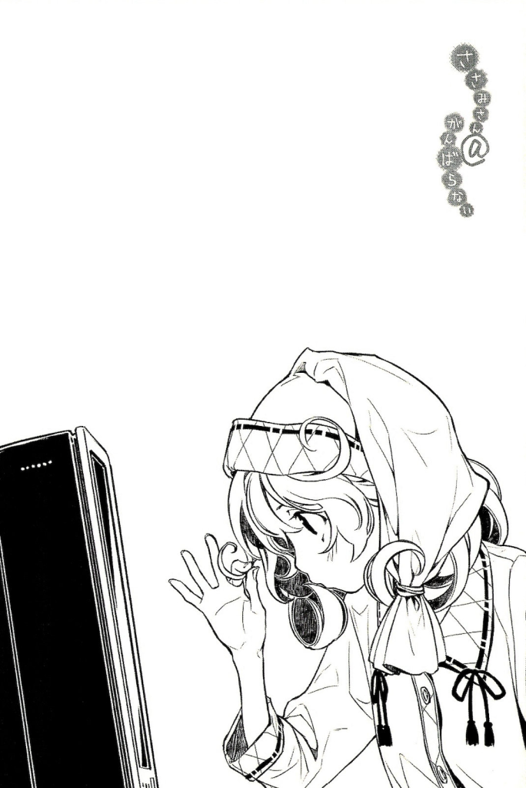

<!DOCTYPE html>
<html lang="en">
<head>
  <meta charset="utf-8">
  <meta http-equiv="X-UA-Compatible" content="IE=edge">
  <meta name="viewport" content="width=device-width, initial-scale=1">
  <!-- The above 3 meta tags *must* come first in the head; any other head content must come *after* these tags -->
  <title>Nanodesu</title>

  <!-- Bootstrap -->
  <link href="../static/bootstrap.min.css" rel="stylesheet">
  <link href="../static/bootstrap-submenu-2.0.1-dist/css/bootstrap-submenu.min.css" rel="stylesheet">
  <link href="../static/site.css" rel="stylesheet">

  <!-- HTML5 shim and Respond.js for IE8 support of HTML5 elements and media queries -->
  <!-- WARNING: Respond.js doesn't work if you view the page via file:// -->
    <!--[if lt IE 9]>
      
      
      <![endif]-->
    </head>
    <body>
     <nav class="navbar navbar-default box">
       

         
       

       

         <!-- Brand and toggle get grouped for better mobile display -->
         

          <button type="button" class="navbar-toggle collapsed" data-toggle="collapse" data-target="#bs-example-navbar-collapse-1" aria-expanded="false">
           Toggle navigation
           
           
           
         </button>
       

       <!-- Collect the nav links, forms, and other content for toggling -->
       

        <ul class="nav navbar-nav centered">
         <li><a href="#">About this translation</a></li>
         <li class="dropdown">
          <a href="#" class="dropdown-toggle" data-toggle="dropdown" role="button" aria-haspopup="true" aria-expanded="false">Volume 1</a>
          <ul class="dropdown-menu" data-submenu>
           <li><a href="#">Color Illustrations</a></li>
           <li class="dropdown-submenu">
            <a href="#">Part 1: Amaterasu</a>
            <ul class="dropdown-menu">
             <li><a href="#">Chapter 1</a></li>
             <li><a href="#">Chapter 2</a></li>
             <li><a href="#">Chapter 3</a></li>
             <li><a href="#">Chapter 4</a></li>
             <li><a href="#">Chapter 5</a></li>
             <li><a href="#">Chapter 6</a></li>
             <li><a href="#">Chapter 7</a></li>
           </ul>
         </li>
         <li class="dropdown-submenu">
          <a href="#">Part 2: Yamata no Orochi</a>
          <ul class="dropdown-menu">
           <li><a href="#">Chapter 8</a></li>
           <li><a href="#">Chapter 9</a></li>
           <li><a href="#">Chapter 10</a></li>
           <li><a href="#">Chapter 11</a></li>
           <li><a href="#">Chapter 12</a></li>
           <li><a href="#">Chapter 13</a></li>
           <li><a href="#">Chapter 14</a></li>
         </ul>
       </li>
       <li class="dropdown-submenu">
        <a href="#">Part 3: Ninigi no Mikoto</a>
        <ul class="dropdown-menu">
         <li><a href="#">Chapter 15</a></li>
         <li><a href="#">Chapter 16</a></li>
         <li><a href="#">Chapter 17</a></li>
       </ul>
     </li>
     <li><a href="#">Afterword</a></li>
     <li><a href="#">PDF and ePub Version</a></li>
   </ul>
 </li>
 <li class="dropdown">
  <a href="#" class="dropdown-toggle" data-toggle="dropdown" role="button" aria-haspopup="true" aria-expanded="false">Volume 2</a>
</li>
<li class="dropdown">
  <a href="#" class="dropdown-toggle" data-toggle="dropdown" role="button" aria-haspopup="true" aria-expanded="false">Volume 3</a>
</li>
<li><a href="#">Update History</a></li>
<li><a href="#">Contact Us</a></li>
</ul>

<!-- /.navbar-collapse -->

<!-- /.container-fluid -->
</nav>

  

   

    

     

      <h4> <a href="../">↸</a></h4>
    

    

      <!-- content start -->
      
<b><i>VOLUME 1</i></b>

<b>PART 1: AMATERASU</b>

<b>Chapter 1: I’ll Start Trying Tomorrow</b>

&quot;Sasami-saaaan~~.&quot;

My brother was calling me. (1)

I flipped my laptop screen closed, and took a nice, long stretch.

The date was February fourteenth.

St. Valentine’s Day.

&quot;Sasami-saaaan~~ It’s morning~~.&quot;

My brother casually came into the room.

He was wearing the suit he usually wore to work (he was a school teacher at a local school) and he used his briefcase to hide his face.

My brother never liked getting his face seen.

I really wished he just went to work without bothering me first though.

I was feeling pretty sluggish while I thought about that, so my body fell sideways.

&quot;Sasami-saaaan~~.&quot;

My brother approached me with suspicious motions, and began to give me his usual speech.

&quot;It’s morning. Early Monday morning. Please try to go to school today.&quot;

&quot;Can’t.&quot;

That was the first thing I said to my brother that morning.

But my brother didn’t seem to mind, and just kept his gaze on me as I lay there.

&quot;Sasami-san. You’re already sixteen. You’re finally a high school student, so how about trying to enjoy high school life for at least a day?&quot;

My brother let out a sigh, and set down the tray he was holding in one hand next to me.

&quot;You must be hungry. I made some breakfast for you.&quot;

&quot;Mm.&quot;

I lifted my head up and looked at what was in my brother’s hands.

On the tray rested sandwiches that had been cut into rectangles.

The sandwiches were made with bananas, kiwis, strawberries, and other fruits, with fresh cream tying everything together. It was quite a colorful sandwich.

&quot;Oniichan.&quot;

Certainly, I did feel a bit hungry, but I stayed lying there.

I just made a few chomping motions with my mouth.

&quot;Feed me.&quot;

&quot;You’re such a baby, Sasami-san. You’re already sixteen.&quot;

&quot;If you don’t feed me, I’m gonna starve to death.&quot;

&quot;Well, I guess I have to then.&quot;

After he had fed me around three of the sandwiches, I felt satisfied.

&quot;Oniichan can have the rest if he wants.&quot;

There was still quite a bit left.

But my brother shook his head.

&quot;I already finished eating. I’ll just leave this here then…&quot;

My brother wrapped the sandwiches up, plate and all.

&quot;If you’re hungry when it’s lunchtime, please help yourself.&quot;

Well, I’m pretty sure I’d be sleeping at noon anyways.

&quot;Would you like something to drink? You ate that in a weird position, so are you sure nothing stuck in your throat?&quot;

&quot;I’m fine. More importantly, you’re going to be late, oniichan.&quot;

Teachers had to wake up early in the morning. They really didn’t have the time to deal with their hikikomori little sisters. (2)

I was satisfied now that my stomach was full, and I felt myself getting sleepy.

&quot;Leave me alone. I’m going to sleep.&quot;

&quot;Okay, okay.&quot;

My brother stroked the top of my head, his hand twirling through my hair.

&quot;Well, I’m off to school then. If Sasami-san feels like it, you should come to school even in the middle of the day. I’d welcome you with open arms any time.&quot;

My brother headed out of my room, although he seemed sad that we were parting.

He headed out of my large yet cramped, peaceful room.

Into that outside world which overflowed with other people and absurd happenings.

&quot;I’m leaving, Sasami-san.&quot;

&quot;Oniichan.&quot;

As I fought my drowsiness, I suddenly remembered something and reached out a hand.

Ah right. I completely forgot. I had gone through the trouble of ordering it too.

Today was February 14th, after all.

I fiddled around with the mail order box, and after tearing open the vinyl wrapping, I took the contents from the box.

It was a small rectangular box, wrapped with fairly plain wrapping paper.

&quot;Here. A bentou for you.&quot; (3)

It would be annoying to throw the bentou to him, so I just held it up instead.

&quot;Hm? What is it?&quot;

My brother came back to my side, took the box, and stared at it intently.

&quot;I already told you, it s a bentou for you.&quot;

I rubbed my eyes. Ugh, I seriously was sleepy.

&quot;Have a nice day, oniichan.&quot;

Today, I wouldn’t try hard either.

TRANSLATOR’S NOTES

(1) Just a note about the convention I will use: I am going to use &quot;brother&quot; in narration and &quot;oniichan&quot; in dialogue or dialogue-like narration. I would use oniichan everywhere, but it sounds pretty awkward when used in normal narration to me.

(2) A hikikomori is a social recluse, someone who refuses to go outside and socialize. There’s actually a lot more to that word, but in the interest of keeping things simple I’ll just say that much.

(3) A lunch box.

     <!-- content end -->
   

 

  

   

    <h6>NanoDesu Translations Home</h6>
    

    

     
   

 

<!-- jQuery (necessary for Bootstrap's JavaScript plugins) -->

<!-- Include all compiled plugins (below), or include individual files as needed -->

</body>
</html>
