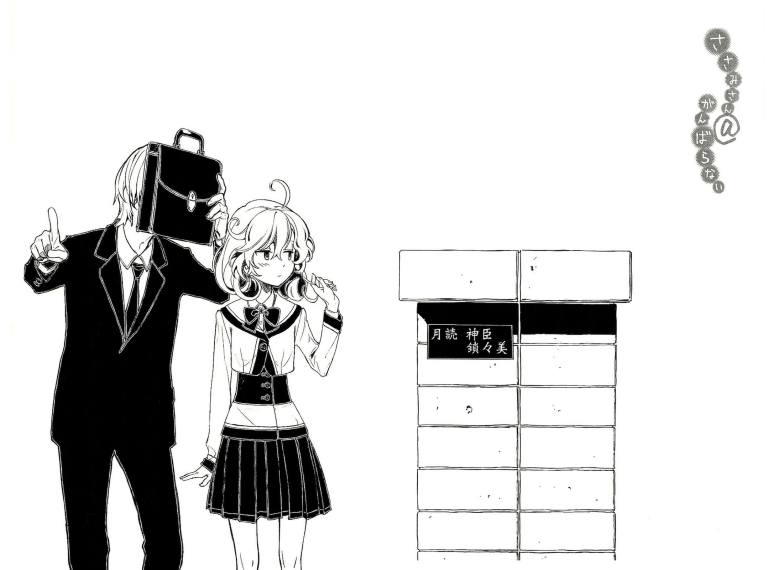

<!DOCTYPE html>
<html lang="en">
<head>
  <meta charset="utf-8">
  <meta http-equiv="X-UA-Compatible" content="IE=edge">
  <meta name="viewport" content="width=device-width, initial-scale=1">
  <!-- The above 3 meta tags *must* come first in the head; any other head content must come *after* these tags -->
  <title>Nanodesu</title>

  <!-- Bootstrap -->
  <link href="../static/bootstrap.min.css" rel="stylesheet">
  <link href="../static/bootstrap-submenu-2.0.1-dist/css/bootstrap-submenu.min.css" rel="stylesheet">
  <link href="../static/site.css" rel="stylesheet">

  <!-- HTML5 shim and Respond.js for IE8 support of HTML5 elements and media queries -->
  <!-- WARNING: Respond.js doesn't work if you view the page via file:// -->
    <!--[if lt IE 9]>
      
      
      <![endif]-->
    </head>
    <body>
     <nav class="navbar navbar-default box">
       

         
       

       

         <!-- Brand and toggle get grouped for better mobile display -->
         

          <button type="button" class="navbar-toggle collapsed" data-toggle="collapse" data-target="#bs-example-navbar-collapse-1" aria-expanded="false">
           Toggle navigation
           
           
           
         </button>
       

       <!-- Collect the nav links, forms, and other content for toggling -->
       

        <ul class="nav navbar-nav centered">
         <li><a href="#">About this translation</a></li>
         <li class="dropdown">
          <a href="#" class="dropdown-toggle" data-toggle="dropdown" role="button" aria-haspopup="true" aria-expanded="false">Volume 1</a>
          <ul class="dropdown-menu" data-submenu>
           <li><a href="#">Color Illustrations</a></li>
           <li class="dropdown-submenu">
            <a href="#">Part 1: Amaterasu</a>
            <ul class="dropdown-menu">
             <li><a href="#">Chapter 1</a></li>
             <li><a href="#">Chapter 2</a></li>
             <li><a href="#">Chapter 3</a></li>
             <li><a href="#">Chapter 4</a></li>
             <li><a href="#">Chapter 5</a></li>
             <li><a href="#">Chapter 6</a></li>
             <li><a href="#">Chapter 7</a></li>
           </ul>
         </li>
         <li class="dropdown-submenu">
          <a href="#">Part 2: Yamata no Orochi</a>
          <ul class="dropdown-menu">
           <li><a href="#">Chapter 8</a></li>
           <li><a href="#">Chapter 9</a></li>
           <li><a href="#">Chapter 10</a></li>
           <li><a href="#">Chapter 11</a></li>
           <li><a href="#">Chapter 12</a></li>
           <li><a href="#">Chapter 13</a></li>
           <li><a href="#">Chapter 14</a></li>
         </ul>
       </li>
       <li class="dropdown-submenu">
        <a href="#">Part 3: Ninigi no Mikoto</a>
        <ul class="dropdown-menu">
         <li><a href="#">Chapter 15</a></li>
         <li><a href="#">Chapter 16</a></li>
         <li><a href="#">Chapter 17</a></li>
       </ul>
     </li>
     <li><a href="#">Afterword</a></li>
     <li><a href="#">PDF and ePub Version</a></li>
   </ul>
 </li>
 <li class="dropdown">
  <a href="#" class="dropdown-toggle" data-toggle="dropdown" role="button" aria-haspopup="true" aria-expanded="false">Volume 2</a>
</li>
<li class="dropdown">
  <a href="#" class="dropdown-toggle" data-toggle="dropdown" role="button" aria-haspopup="true" aria-expanded="false">Volume 3</a>
</li>
<li><a href="#">Update History</a></li>
<li><a href="#">Contact Us</a></li>
</ul>

<!-- /.navbar-collapse -->

<!-- /.container-fluid -->
</nav>

  

   

    

     

      <h4> <a href="../">↸</a></h4>
    

    

      <!-- content start -->
      
<b><i>VOLUME 1</i></b><b>Chapter 2: The Third Sister, Tama</b>

After he was done talking with me, my brother casually left the house.

Or rather, he stopped right in front of the front gate of our house (A two floor house. The second floor’s walls had all been knocked down, and the entire floor had been converted into my room. The first floor was my brother’s living space, the bathroom, and etc. etc.).

<b>Tsukuyomi Kamiomi &amp; Sasami</b>

That was written on the nameplate. My brother stared at that nameplate, spellbound.

“Fufu… fufufu… it’s like we’re husband and wife… fufufu…”

He muttered a few gross things like that to himself, and then cheerfully began pedaling his bike.

@@@@@@

As my brother proceeded unsteadily towards work, he suddenly stopped and cocked his head to the side.

The town we lived in, Amenonuboko (1), was a completely normal residential town. If you headed towards the station, you could find some more hustle and bustle, but it was mostly a lazy town filled with normal houses.

“There’s something… strange…”

My brother skillfully rode his bike while he covered his face with one hand, and then…

“A demon… or something like that…”

As my brother babbled nonsensical things, he moved to a certain place.

In that place was a river, which lay at the base of the number of mountains that dotted our town.

The road there wasn’t paved, the water was pristine, and small splashes of water bounced off of the rocks that were scattered about.

My brother dismounted his bicycle and approached the river on foot.

“……?”

He cocked his head to the side and looked all around him, when…

“Croak croaaaak~~!”

Suddenly…

Right in front of my brother, a bulge formed right around the middle of the river, and something burst out through the water and leapt towards him!

“……?!”

My brother threw his head back in surprise, and the mysterious object landed a few meters from him.

The object opened its mouth, and shouted in an innocent-sounding voice.

“Tama-chan is~~!”

She didn’t seem to mind the river’s current or the coldness of the winter, and just stood there with a full smile.

“A cute, healthy frog! Croak croaaaak~~!”

She let out some rather bizarre words.

It was a person.

Not only that, it was a girl beautiful enough that should she walk through the town, anybody would turn their heads to get a second look.

However, considering she appeared right out of the middle of the river, you also got the feeling that she was someone you didn’t want to associate with.

Oniichan, run away!

“Hm?”

But my brother just stood there with a puzzled expression on his face at this girl who appeared as if she was the goddess of the river.

“Tama-san, isn’t it? What are you doing there?”

Oh?

Was this someone he knew?

Feeling a bit suspicious, I squinted my eyes and took a good luck (In the end, from this perspective, trying to see things with my own eyes wasn’t enough for me to understand the situation…)

When I took a nice, long look, I realized that the pretty girl who appeared from the lake was definitely…

Was definitely none other than the youngest of the three Yagami sisters, Yagami Tama.

“… Whaa?”

Tama said something strange and her eyes widened.

“Ah! Paparin!”

For some reason, Tama had branded my brother with the name “Paparin.”

“Good morning~~~”

“Tama-san, what are you doing over there? You’ll catch a cold, you know.”

“Well, umm, you see…”

Tama climbed onto the riverside and shook her entire body, spraying water everywhere.

It was almost like she wasn’t wearing anything underneath. The moisture clung to her body and all her body’s lines were visible, making her seem bizarrely seductive.

However, she still behaved completely innocently, moving about and conducting herself almost like an infant.

“Croak croaaak! Tama is a frog!”

“……?”

My brother cocked his head to the side at this girl who defied logic.

Tama seemed to be unsatisfied at his reaction, and her lips thinned into a frown.

“Umm… you know, Tama you know, she always plays around here! With the frogs! But, you know, all the frogs went away! So Tama is now the frog instead!”

She looked like she could be a company executive’s private secretary, but she behaved completely like a child.

And it made sense.

After all, Tama was nine, and was in her third year of elementary school.

As proof of that, she happily swung her red leather bookbag onto her back. (2)

“Haha, I see.”

My brother acted like he actually understood the nonsense that was coming from Tama’s mouth.

“You’re a kind girl, aren’t you, Tama?”

“Waaah, a compliment~~!”

“But, Tama-san. The frogs didn’t go away. They’re probably just hibernating.”

“Hai-ber-nating?”

“Yes. There’s no food in the winter, so the frogs go to sleep so they don’t waste energy. They aren’t dead.”

“Ahh, so like Mamarin!”

“………?”

My brother seemed at a loss at her cryptic words.

“So, there’s no need for you to become a frog. Actually, if you make too much noise, the frogs won’t be able to sleep. I mean, if someone was being noisy near Tama-san when she was asleep, what would she do?”

“She would kill them!”

“I know, right?”

Wait, no, killing them wouldn’t be good at all.

“So, Tama-san, let’s be quiet and let the frogs sleep peacefully. Don’t worry. Once spring comes, they’ll show up again. You can go and play with them then… understood?”

“………”

Tama furrowed her brow and sunk into thought for a bit.

Finally, she flashed her teeth and gave my brother a broad smile.

“Got it! Tama won’t bother the frogs when they sleep!”

“Tama-san is a good girl!”

My brother patted Tama on her head.

“So Tama-san, please go to school. Your school is in the opposite direction, isn’t it? It just won’t be good if you’re late.”

“Ah, you’re right!”

She seriously forgot about school up until now? What a kid.

At the same time, her belly emitted a cute-sounding growl.

“Wah!”

Tama didn’t seem embarrassed at all.

“Paparin, Tama is hungwy! Actually, Tama really wanted to get here to be a frog, so Tama forgot to eat breakfast!”

“My my.”

My brother seemed to sympathize, and then… as if it was the most natural thing in the world…

He held out the box I had given him in the morning.

“Well, I’ll give you this then. It’s my lunch, but I can just buy lunch at school, so I’ll be fine. Just walk to school and you can eat this on the way.”

“Eh? You’re giving this to Tama? Really?”

Tama seemed just a bit hesitant, but her stomach seemed to win out and she took the box.

She gingerly held the box to her and gave a shy laugh.

“Thank you, Paparin… Tama loves you.”

Tama hugged my brother tight and then began to energetically ran off, her backpack swinging behind her.

“See you, Paparin! Tama is going to school! Paparin should do his best at work too!”

“Tama left the house today without eating breakfast, so Tsurugi-nee and Kagami-nee might be angry. So please say sorry to them for Tama! Ehehe… see you, Paparin!”

After she announced that, with a pure and naïve smile, Tama darted off.

TRANSLATOR’S NOTES

(1) A reference to a famous spear in Japanese mythology that was used to raise land from the sea.

(2) Standard for elementary school girls in Japan.

     <!-- content end -->
   

 

  

   

    <h6>NanoDesu Translations Home</h6>
    

    

     
   

 

<!-- jQuery (necessary for Bootstrap's JavaScript plugins) -->

<!-- Include all compiled plugins (below), or include individual files as needed -->

</body>
</html>
